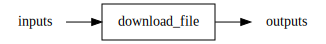
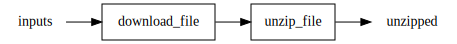
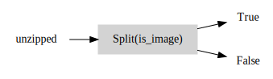
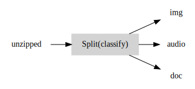
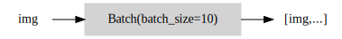
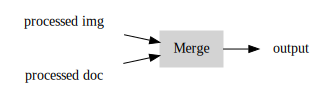
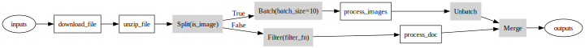

# _skorche_

_skorche_ is (or will be!) a lightweight python library for simple task orchestration and pipeline management. It provides a declarative API for constructing workflows and pipelines out of existing functions and allows different parts of the pipeline to operate asynchronously and scale independently.

```python
input_files = ['cat1.zip', 'cat2.zip', 'dog1.zip']

q_in = skorche.Queue(input_files)
q = skorche.chain([download_file, unzip_file], q_in)

(q_cats, q_dogs) = skorche.split(is_cat_or_dog, q)
q_cats = skorche.map(meow, q_cats)
q_dogs = skorche.map(woof, q_dogs)

q_out = skorche.merge([q_cats, q_dogs])

skorche.run()

while True:
    result = q_out.get()
```

## Features

- **Declarative API**: `skorche` provides an intuitive and straightforward API for defining pipelines.
- **Pipeline Semantics**: `map` tasks to queues, `chain` together multiple tasks, and `split` and `merge` pipelines to compose complex computational graphs.
- **Asynchronous Execution**: `skorche` manages thread and process pools allowing tasks to operate in parallel and scale.
- **Pipeline rendering**: Use `skorche`'s built-in graph renderer to visualise your pipelines.
- **Graph Analyzer**: (Planned) Profile your pipeline in realtime to identify hotspots or let `skorche` manage load balancing entirely.

## Example

Pipelines are constructed from instances of `Task`, `Queue` and `Op`. In the following example we will build a pipeline for processing images and documents.

### Tasks

Decorate existing functions with `@skorche.task` to turn them into `Task` instances:

```python
@skorche.task(max_workers=4)
def download_file(fname):
    pass

@skorche.task
def unzip_file(fname):
    pass

@skorche.task
def process_images(fname_list):
    # Processes multiple images in one batch
    pass

@skorche.task
def process_doc(fname):
    pass
```

### Queues

Pipeline are computational graphs in which each `Queue` is a directed edge between two nodes, and where each node is a `Tasks` or `Op`. First, instantiate a `Queue` which will act as the input into the whole system:

```python
input_files = ['file1.zip', 'file2.zip', 'file3.zip']
q_inputs = skorche.Queue(fixed_inputs=input_files)
```

### `map` and `chain`

The simplest example of a pipeline consists of a function that transforms some input queue into an output queue. `skorche` provides this as a `map`:

```python
q_outputs = skorche.map(download_file, q_inputs)
```

This line is a purely declarative statement that tells `skorche` to bind the task to the input and output queues. Actual execution of this task is deferred until later.



In our case, we have a series of composable functions `download_file`, `unzip_file`, so we could write out a series of map bindings:

```python
q_zipped = skorche.map(download_file, q_inputs)
q_unzipped = skorche.map(unzip_file, q_zipped)
```

`skorche` provides the `chain` function to make this simpler:

```python
q_unzipped = skorche.chain([download_file, unzip_file], q_inputs)
```

Any number of tasks can be chained together as long as they are composable from left to right -- that is, $[f, g, h]$ will be chained into $h(g(f(input)))$.



### Operations: `split`, `batch`, `unbatch`, `merge`

We now have a queue of unzipped folders, each of which either contains an image or a doc, but we have separate functions for processing these: `process_images` and `process_doc`. In this case, we want to split the pipeline:

```python
def is_image(fname):
    # Returns True if fname is an image or False if doc
    pass

(q_img, q_doc) = skorche.split(is_image, q_unzipped)
```

We now have two queues which are ready to be mapped over by different tasks.



The predicate function used by `split` does not need to return `bool`, but its return values must be enumerable and be passed explicitly to `split()`. For example, a splitting operation might classify a task into one of three categories: `'img'`, `'doc'`, `'audio'`:

```python
def classify(task_item):
    # Returns one of "img", "doc", "audio"
    pass

(q_img, q_doc, q_audio) = skorche.split(classify, unzipped, predicate_values=("img", "doc", "audio"))
```

The order of the predicate values must correspond to the order of the output queues. The graph would look like the following:



`process_image` defined above expects a batch of images to process in one go. `skorche` achieves this like so:

```python
q_img_batch = skorche.batch(q_img, batch_size=10)
```



Maybe some documents are irrelevant to us and we need not process them. `skorche` provides a `filter` to remove these from the pipeline.

```python
q_doc_filtered = skorche.filter(filter_fn, q_doc)
```


We are now ready to map over these two queues:

```python
q_doc_processed = skorche.map(process_doc, q_doc_filtered)
q_img_processed = skorche.map(process_images, q_img_batch)
q_img_processed = skorche.unbatch(q_img_processed)
```

and finally merge the two queues back again:

```python
q_out = skorche.merge((q_img_out, q_doc_out))
```



### Pipeline rendering

All we have done so far is declare our pipeline. None of the tasks have executed any code yet, but `skorche` has built the pipeline, and can render it:

```python
skorche.render_pipeline(filename="graph", root=q_inputs)
```

This will traverse the graph starting from the `root` input queue. In the case of multiple input queues, `root=(q1, q2, ...)` will work.



### Execution

Now time to run it:

```python
skorche.run()
skorche.shutdown()  # blocks until all tasks are done
```

Invoking `run()` turns skorche Queues into multiprocessing Queues, submits `Task` nodes to a pool, and runs any `Op` nodes in the main thread. `shutdown()` blocks until all pool tasks have completed.

### Putting this together

Our complete program looks like this:

```python
import skorche

@skorche.task
def download_file(fname):
    pass

@skorche.task
def unzip_file(fname):
    pass

@skorche.task
def process_images(fname_list):
    # Processes multiple images in one batch
    pass

@skorche.task
def process_doc(fname):
    pass

# Op predicates are not skorche tasks
def is_image(fname):
    pass

def filter_fn(fname):
    pass

if __name__ == "__main__":
    input_files = ["file1.zip", "file2.zip", "file3.zip"]

    # input and output queues
    queue_in = skorche.Queue(name="inputs", fixed_inputs=input_files)
    queue_out = skorche.Queue(name="outputs")

    # chain together two tasks sequentially
    q_unzipped = skorche.chain([download_file, unzip_file], queue_in)

    # split based on file type
    (q_img, q_doc) = skorche.split(is_image, q_unzipped)

    # image processing branch
    q_img_batch = skorche.batch(q_img, batch_size=10)
    q_img_out = skorche.map(process_images, q_img_batch)
    q_img_out = skorche.unbatch(q_img_out)

    # doc processing branch
    q_doc_filtered = skorche.filter(filter_fn, q_doc)
    q_doc_out = skorche.map(process_doc, q_doc_filtered)

    # merge branches to output queue
    queue_out = skorche.merge((q_img_out, q_doc_out), queue_out=queue_out)

    # Visualise pipeline. Writes to ./graphviz/demo.svg
    skorche.render_pipeline(filename="demo", root=queue_in)

    # Run pipeline
    skorche.run()
    skorche.shutdown()

    # pop all outputs from queue into list
    results = queue_out.flush()
```
