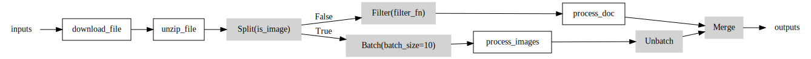
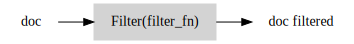

# _skorche_

_skorche_ is (or will be!) a lightweight python library for simple task orchestration. It provides a declarative API for constructing workflows and pipelines out of existing functions and allows different parts of the pipeline to operate asynchronously or in parallel.



## Features

- **Declarative API**: _skorche_ provides an intuitive and straightforward API for defining pipelines.
- **Pipeline Semantics**: `map` tasks to queues, `chain` together multiple tasks, and `split` and `merge` pipelines to compose complex computational graphs.
- **Asynchronous Execution**: _skorche_ manages thread pools allowing tasks to operate asynchronously. Support for process pools is planned.
- **Pipeline rendering**: Use _skorche_'s built-in graph renderer to visualise pipelines.
- **Graph Analyzer**: (Planned) Profile pipelines in realtime to identify hotspots or let _skorche_ manage load balancing entirely.

# Example

_Pipelines_ are constructed from instances of `Task`, `Queue` and `Op`. _Tasks_ are the user-defined computational units that do most of the heavy lifting, while _Ops_ are lightweight logical units (eg. `split`, `merge`, `filter`) that act as the basic building blocks for complex topologies. _Queues_ are the edges in the graph that connect _Tasks_ and _Ops_. Each _Queue_ has precisely one producer and one consumer.

In the following example we will build a pipeline for processing images and documents.

## Tasks

Decorate existing functions with `@skorche.task` to turn them into `Task` instances:

```python
@skorche.task
def download_file(fname):
    pass

@skorche.task
def unzip_file(fname):
    pass

@skorche.task
def process_images(fname_list):
    # Processes multiple images in one batch
    pass

@skorche.task
def process_doc(fname):
    pass
```

## Queues

First, instantiate a `Queue` which will act as the input into the whole system:

```python
input_files = ['file1.zip', 'file2.zip', 'file3.zip']
q_inputs = skorche.Queue(fixed_inputs=input_files)
```

### Mapping tasks over queues: `map`

The simplest example of a pipeline consists of a function that can be _mapped_ across some input queue, to produce an output queue. _skorche_ provides such a `map`:

```python
q_outputs = skorche.map(download_file, q_inputs)
```

This line is a purely declarative statement: it tells _skorche_ to bind the task to the input and output queues, but the task function is not yet executed (indeed, the input queue might not even be populated yet).

Execution of all tasks is deferred until a call to `skorche.run()` is made once the entire pipeline has been constructed.


### Composing tasks: `chain`

In our case, we have a series of composable functions `download_file`, `unzip_file`, so we could write out a series of map bindings:

```python
q_zipped = skorche.map(download_file, q_inputs)
q_unzipped = skorche.map(unzip_file, q_zipped)
```

_skorche_ provides the `chain` function to make this simpler:

```python
q_unzipped = skorche.chain([download_file, unzip_file], q_inputs)
```

Any number of tasks can be chained together as long as they are composable from left to right -- that is, $[f, g, h]$ will be chained into $h(g(f(input)))$.


## Operations: `split`, `batch`, `unbatch`, `merge`

We now have a queue of unzipped folders, each of which either contains an image or a doc, but we have separate functions for processing these: `process_images` and `process_doc`. In this case, we want to split the pipeline, which can be done by introducting _Operations_, or `Op` nodes.

### Splitting a queue: `split`

```python
def is_image(fname):
    # Returns True if fname is an image or False if doc
    pass

(q_img, q_doc) = skorche.split(is_image, q_unzipped)
```

This tells _skorche_ to create a `Split` node on the graph. The predicate function `is_image` will be evaluated on each input, and the item will be routed to the corresponding output queue.


_Note_: The function used by `split` does not need to be a predicate function `bool`, but its return values must be enumerable and be passed explicitly to `split()`. For example, a splitting operation might classify a task into one of three categories: `'img'`, `'doc'`, `'audio'`:

```python
def classify(task_item):
    # Returns one of "img", "doc", "audio"
    pass

(q_img, q_doc, q_audio) = skorche.split(classify, unzipped, predicate_values=("img", "doc", "audio"))
```

The order of the predicate values must correspond to the order of the output queues. The graph would look like the following:


### Batching and unbatching: `batch`, `unbatch`

`process_image` defined above expects a batch of images to process in one go. _skorche_ achieves this like so:

```python
q_img_batch = skorche.batch(q_img, batch_size=10)
```


We can also unbatch a queue with `skorche.unbatch(queue)`.

### Filtering: `filter`

Maybe some documents are irrelevant to us and we need not process them. _skorche_ provides a `filter` to remove these from the pipeline.

```python
q_doc_filtered = skorche.filter(filter_fn, q_doc)
```



We are now ready to map over these two queues:

```python
q_doc_processed = skorche.map(process_doc, q_doc_filtered)
q_img_processed = skorche.map(process_images, q_img_batch)
q_img_processed = skorche.unbatch(q_img_processed)
```

### Merging multiple queues: `merge`

Merging multiple queues is handled by `merge()`. The queues to be merged should be passed as a tuple. The order in which _skorche_ reads from each queue is unspecified.

```python
q_out = skorche.merge((q_img_out, q_doc_out))
```


### Pipeline rendering

All we have done so far is declare our pipeline. None of the tasks have executed any code yet, but _skorche_ has built a static model of the pipeline architecture, and can render it using [graphviz](https://graphviz.org/):

```python
skorche.render_pipeline(filename="graph", root=q_inputs)
```

This will traverse the graph starting from the `root` input queue. In the case of multiple input queues, `root=(q1, q2, ...)` will work.


### Execution

All task execution is handled by `skorche.run()`.

```python
skorche.run()
skorche.shutdown()  # blocks until all tasks are done
```

Invoking `run()` turns _skorche_ Queues into multiprocessing Queues, submits `Task` nodes to a pool, and runs any `Op` nodes in the main thread. `Tasks` and `Ops` will read from their input queues until `skorche.QUEUE_SENTINEL` is reached at which point they propagate the sentinel value and exit. `skorche.shutdown()` blocks the main thread until all pool tasks have completed.

### Putting this together

Our complete program looks like this:

```python
import skorche

@skorche.task
def download_file(fname):
    pass

@skorche.task
def unzip_file(fname):
    pass

@skorche.task
def process_images(fname_list):
    # Processes multiple images in one batch
    pass

@skorche.task
def process_doc(fname):
    pass

# Op predicates are not skorche tasks
def is_image(fname):
    pass

def filter_fn(fname):
    pass

if __name__ == "__main__":
    input_files = ["file1.zip", "file2.zip", "file3.zip"]

    # input and output queues
    queue_in = skorche.Queue(name="inputs", fixed_inputs=input_files)
    queue_out = skorche.Queue(name="outputs")

    # chain together two tasks sequentially
    q_unzipped = skorche.chain([download_file, unzip_file], queue_in)

    # split based on file type
    (q_img, q_doc) = skorche.split(is_image, q_unzipped)

    # image processing branch
    q_img_batch = skorche.batch(q_img, batch_size=10)
    q_img_out = skorche.map(process_images, q_img_batch)
    q_img_out = skorche.unbatch(q_img_out)

    # doc processing branch
    q_doc_filtered = skorche.filter(filter_fn, q_doc)
    q_doc_out = skorche.map(process_doc, q_doc_filtered)

    # merge branches to output queue
    queue_out = skorche.merge((q_img_out, q_doc_out), queue_out=queue_out)

    # Visualise pipeline. Writes to ./graphviz/demo.svg
    skorche.render_pipeline(filename="demo", root=queue_in)

    # Run pipeline
    skorche.run()
    skorche.shutdown()

    # pop all outputs from queue into list
    results = queue_out.flush()
```
